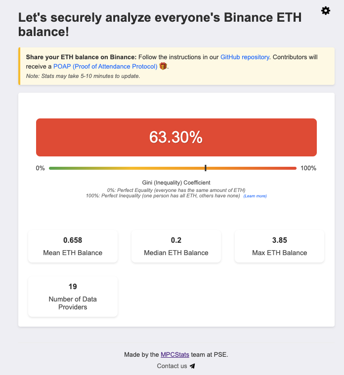

# Demo at Devcon 2024

We had a demo at [Devcon 2024](https://www.youtube.com/watch?v=wCp7Zsjou7w) where participants can prove and share their Binance ETH balance in their spot account using the Binance API. We then derive the mean, median, max, and gini index of the balances of all participants, without revealing their individual balances.

This demo demonstrates how real-world data sources like Binance can be securely integrated into privacy-preserving statistical computations using MPC and TLSNotary. It's a foundational step toward building tools that enable collaborative data analysis while preserving user privacy.

You can explore our [implementation code](https://github.com/ZKStats/mpc-demo-infra) and read our detailed [Devcon Demo Report](https://pse-team.notion.site/MPCStats-Devcon-Demo-Report-3055bb69afd24d60bf8ee8d4fa5f774c) to learn more about the technical details and outcomes of this demonstration.

Below is what our stats page looked like:

<!--
## (TODO) 2. Simple Example

- **Branch:** [`simple`](https://github.com/ZKStats/mpc-demo-infra/tree/simple)

Three participants prove and share their followers count on [page 0](https://jernkunpittaya.github.io/followers-page/party_0.html), [page 1](https://jernkunpittaya.github.io/followers-page/party_1.html), and [page 2](https://jernkunpittaya.github.io/followers-page/party_2.html), respectively. We then derive the statistics of all participants using MPC. -->
