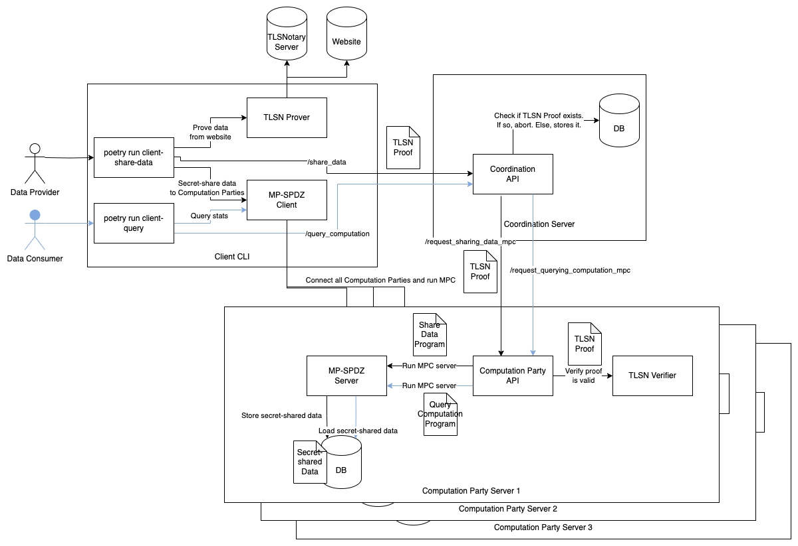
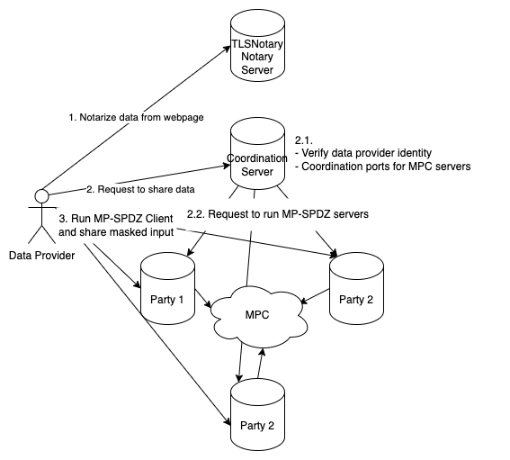

# Architecture

We use a client-server architecture where data providers and consumers delegate MPC computations to three long-running computation parties. This setup balances user experience and data security, allowing participants to submit data without staying online during computation while ensuring privacy through non-colluding servers.

## Components

Below is the workflow of the demo. The black arrows are the flow for sharing data and the blue ones are the flow for querying the results.

- **Coordination Server**: Coordinates communication between data providers, data consumers, and computation parties.
  - Implements basic congestion control, rate-limiting, and sybil prevention to maintain system robustness.
  - Does not access or store plaintext data.
- **Computation Party Servers (3 servers)**:
  - Store encrypted data received from data providers.
  - Perform statistical operations defined in MPC   while verifying the data matches TLSNotary proof.
  - Return results to data consumers.
  - Each party operates independently to ensure security.
- **TLSNotary Server**: Data providers use it to generate proofs confirming their data is authenticated from verified websites.
- **(Optional) Client API**:
  - It's not shown in the diagram above since it's basically a data consumer that polls computation parties for results and caches them.
  - Offers a simple REST API for end users to query statistical results without directly interacting with the Coordination Server, preventing unnecessary MPC computations.

## System Workflow

### Data Proving and Sharing

1. **Proof Generation**: Data providers use the TLSNotary Server to prove data authenticity.
2. **Submission**: Data providers submit the TLSNotary proof to the Coordination Server, signaling their intent to share data. The Coordination Server instructs computation parties to initiate an MPC session on designated ports and wait for incoming data.
3. **Data Sharing**: Data providers use a client to secret-share their data with the computation parties.
   - Computation parties verify the secret-shared data against the TLSNotary proof. Invalid submissions are rejected. Otherwise, store the secret-shared data.

### Query Computation

1. **Query Submission**: Data consumers send a query to the Coordination Server to request aggregated statistics.
2. **Computation Trigger**: The Coordination Server instructs computation parties to perform MPC on all submitted encrypted data.
3. **Result Retrieval**: Data consumers obtain the statistical results from computation parties through the client interface.

## Security Considerations

- **Coordination Server**:
  - Centralized to streamline coordination but does not access or store plaintext data.
  - Rate-limiting and participant verification reduce the risk of Sybil attacks and DoS.
- **Notary Server**:
  - Participants trust the Notary Server to generate a correct proof.
  - By default, we use a local notary whose private keys are exposed, so it's possible for people to forge it. A trusted party running a remote notary server can mitigate this risk.
- **Computation Parties**: Computation parties must be operated by non-colluding entities to prevent reconstruction of participants' balances.
