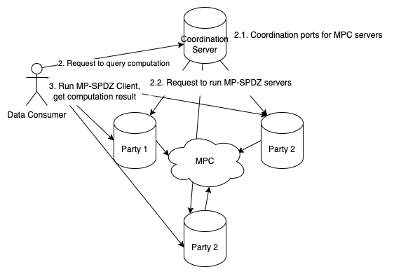

# Architecture

We use a client-server architecture, where there are 3 parties running all the time while data providers and consumers serve clients, i.e. data providers can go offline after providing their data and data consumers can go offline after querying the results.

The core components are:

- **Coordination Server**: provides API for data providers and consumers to interact with, and coordinates computation sessions between computation parties.
  - Verifies TLSNotary proof and prevents Sybil attacks.
  - Implements rate-limiting to prevent DoS attacks.
- **Computation Parties**:
  - Store secret-shared data received from data providers.
  - Perform MPC computations defined in DSL
  - Return results to data consumers.
  - Each party operates independently to ensure security.
- **TLSNotary Server**: data providers prove their data using it.
  - Modified from the original TLSNotary server so the proved data is a commitment instead of plaintext. Later in MPC program, we verify the commitment matches the data provider's data.
- **(Optional) Client API**:
  - It's essentially a data consumer, but it's a REST API service that periodically polls computation parties for results and caches them
  - Provides a simple interface for end users to query statistical results without interacting with the coordination server (and thus triggering MPC computations)

## Workflow

### Data Proving and Sharing

1. Data providers prove their balance using the Notary Server and obtain a TLSNotary proof.
2. Data providers submit the TLSNotary proof to the Coordination Server, signaling their intent to share data.
3. The Coordination Server instructs computation parties to initiate an MPC session on designated ports and wait for data providers to connect.
4. Data providers run a client to secret-share their balance with the computation parties.
   - Computation parties verify if the secret-shared balance matches the one in the TLSNotary proof. If not, they reject the data provider.

### Query Computation

1. Data consumers submit a query to the Coordination Server, requesting aggregated statistics.
2. The Coordination Server instructs computation parties to perform MPC on the shared data.
3. Data consumers retrieve the statistical results from the computation parties through the client interface.

## Security Considerations

- Coordination Server:
  - Centralized to streamline coordination but does not access or store plaintext data.
  - Rate-limiting and participant verification reduce the risk of Sybil attacks and DoS.
    - In Binance case, we expose a field "uid" in the TLSNotary proof, which is a unique identifier for each data provider. This way we prevent Sybil attacks by checking if the uid is unique.
- Notary Server:
  - Participants trust the Notary Server to generate a correct proof.
  - By default, we use a local notary whose private keys are exposed, so it's possible for people to forge it. Running a remote notary server can mitigate this risk.
- Computation Parties: Computation parties must be operated by non-colluding entities to prevent reconstruction of participants' balances.
