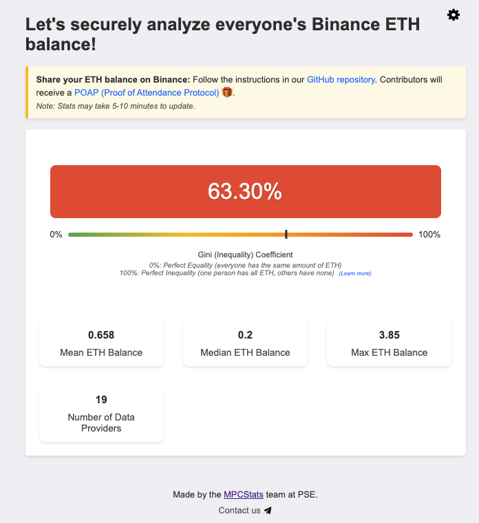

# Examples

We have two examples to demonstrate different use cases, each maintained in a separate branch of the repository.

## 1. Simple Example

- **Branch:** [`simple`](https://github.com/ZKStats/mpc-demo-infra/tree/simple)

Three participants prove and share their followers count on [page 0](https://jernkunpittaya.github.io/followers-page/party_0.html), [page 1](https://jernkunpittaya.github.io/followers-page/party_1.html), and [page 2](https://jernkunpittaya.github.io/followers-page/party_2.html), respectively. We then derive the statistics of all participants using MPC.

## 2. Binance ETH Balance Example
- **Branch:** [`main`](https://github.com/ZKStats/mpc-demo-infra/tree/main)

This example was built for our [Devcon 2024 demo](https://pse-team.notion.site/MPCStats-Devcon-Demo-Report-3055bb69afd24d60bf8ee8d4fa5f774c). Participants can prove and share their Binance ETH balance in their spot account using the Binance API. We then derive the mean, median, max, and gini index of the balances of all participants, without revealing their individual balances.

