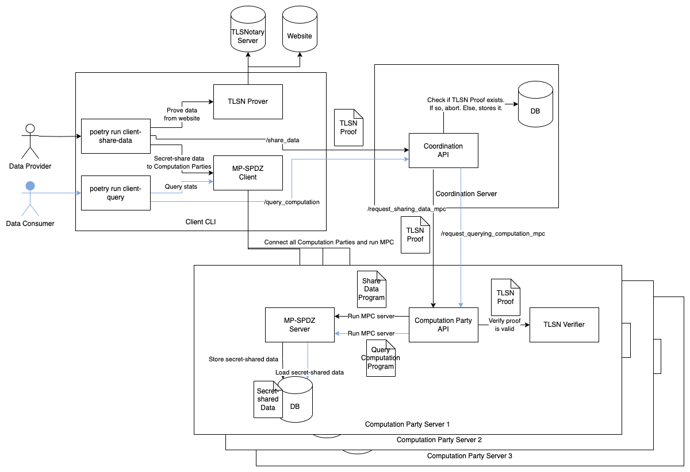

# Customization

Developers can modify and extend the Binance ETH Balance Demo to create their own privacy-preserving applications. This can be using other data sources, different statistical operations, stricter verification for sharing data, etc.




Follow the steps below to customize the components.

## 1. Modify the TLSNotary prover and verifier for new data sources.

> This is a bit different from original TLSNotary, because in addition to being able to specify "redacted" parts of data where they are just not shown in the proof, users can also specify the "private" parts in the proof, which are not only not shown in the proof, but also having their sha3 commitment in the proof such that they can be seamlessly integrated with MP-SPDZ to make sure that the inputs of MP-SPDZ actually come from the private parts of these data from TLSNotary. This guide will mostly focus on customizing this additional "private" feature.

We have a few examples [here](https://github.com/MPCStats/mpc-demo-infra/tree/main/tlsn/tlsn/examples), but to be fully compatible with end-to-end flow, let's take a look at how to customize this TLSNotary prover and verifier from Binance Eth Balance [Example](https://github.com/MPCStats/mpc-demo-infra/tree/main/tlsn/tlsn/examples/binance) by modifying the following files:

### 1.1. TLSN Prover

The TLSN prover for Binance ETH balance is in [binance_prover.rs](https://github.com/MPCStats/mpc-demo-infra/blob/main/tlsn/tlsn/examples/binance/binance_prover.rs). It's the main file for creating proof, where you can make this following customizations for "private" part of data.

**In main()**:

- Specify "secret_file" format, the json format of the secret and its corresponding nonce to be written into the file containing all private information used to prove later that its sha3 hash is the sha3 commitment contained in the proof.

**In build_proof_with_redactions()**:

- Specify "redacted" parts in sent message.
  In this Binance example, we want to redact lots of things like user_agent, api_key and signature. We achieve so by both specifying private_seq and private_regexes (will become obvious once looking at the code) and then just combine them together to achieve sent_public_ranges.

- Specify "public" parts of the received message.
  We specify the part that we want to make it publicly shown in the proof (recv_public_ranges), by specifying the regex that must be "redacted" & "private"

- Specify "private" parts of the received message.
  We specify the private part (recv_private_ranges)that will be accompanied with sha3 commitment in the proof while being censored from the proof itself by specifying our preferred regex. In Binance example, we specify to make ETH free balance of only 2 decimlals precision private.

> With this structure, there will be some parts of received message that is not in either recv_public_ranges or recv_private_ranges. Those will be just redacted data that are censored without its corresponding commitment (like in original TLSNotary)

> Since we decide which part to censor based on regex, it is very important to make sure that the returned data is formatted as you expect when you write regex or else there may result in unexpected data leaking. In our case, we enforce the check that recv transcript ends with uid because this is the assumption that we used to constrain regex in determining recv_public_ranges

> In getting data from API, it's recommended to specify as many arguments for API query as possible because we prefer the data sent back from API to be as smallest as possible.

### 1.2. TLSN Verifier

Here, we just encapsulate the logic that distinguishes which part is just redacted, and which part is private.

```
    sent.set_redacted(b'X');
    recv.set_redacted(b'X');
    recv.set_private(b'Y');
```

## 2. Update the MPC program to include additional or modified statistical operations.

We define a computation template in [query_computation.mpc](https://github.com/MPCStats/mpc-demo-infra/blob/d8de6b4dcf85ff434ca48cb2af3bd00de43aba8a/mpc_demo_infra/program/query_computation.mpc#L26-L64). Whenever there is a new stats query, each MPC party fill in necessary information in this template and runs the program with other MPC parties.

```python
# Filled in by computation party
PORTNUM = {client_port_base}
MAX_DATA_PROVIDERS = {max_data_providers}
NUM_DATA_PROVIDERS = {num_data_providers}
```

Actual statistical operations are done in [`computation` function](https://github.com/MPCStats/mpc-demo-infra/blob/d8de6b4dcf85ff434ca48cb2af3bd00de43aba8a/mpc_demo_infra/program/query_computation.mpc#L26-L64). You can see the following lines in the function
```python=
    result[0] = sint(num_data_providers)
    # Max
    result[1] = data[num_data_providers-1]
    # Sum
    result[2] = sum(data)
    # Median
    result[3] = mpcstats_lib.median(data)

    # Note that Gini coefficient = (area/(num_data_providers*result[1])) - 1
    # But we leave that to client side handling to optimize calculation in mpc
    area = sint(0)
    @for_range(num_data_providers)
    def _(i):
        area.update(area+(2*i+1)*data[i])
    result[4] = area
```
We return the results in `result` array.
- `result[0]` is the number of data providers.
- `result[1]` is the max value of data.
- `result[2]` is the sum of data.
- `result[3]` is the median of data.
- `result[4]` is the area of the gini coefficient.

You can see for `result[3]`, we use `mpcstats_lib.median(data)` to calculate the median of data. Aside from `median`, we provide implementations of common statistical operations in `mpcstats_lib` so you can just import them and use:
- stats operations: `mean`, `median`, `covariance`, `correlation`, `geometric_mean`, `mode`, `variance`, `linear_regression`, `harmonic_mean`
- data operations: `where`, `join`

See the implementation [here](https://github.com/MPCStats/MP-SPDZ/blob/cdad13da73d4bcd7e10c04efd8c22cba7453f0c3/mpcstats/mpcstats_lib.py#L79-L303). To learn more about the DSL for MPC program, make sure to check out [MP-SPDZ documentation](https://mp-spdz.readthedocs.io/en/latest/readme.html).

After changing the MPC program, you also need to update the [Client CLI](https://github.com/MPCStats/mpc-demo-infra/blob/c57245417eec906947bd463e4651ecc528f949ce/mpc_demo_infra/client_lib/lib.py#L107-L113) so that it parse the result correctly.

```python
    results = StatsResults(
        num_data_providers = num_data_providers,
        max = safe_div(output_list[1], 10 * BINANCE_DECIMAL_SCALE),
        mean = safe_div(output_list[2], num_data_providers * 10 * BINANCE_DECIMAL_SCALE),
        median = safe_div(output_list[3], 10 * BINANCE_DECIMAL_SCALE),
        gini_coefficient = safe_div(output_list[4], num_data_providers * output_list[2]) - 1,
    )
```
Here, we parse the result from the MPC program. Values are divided by `10 * BINANCE_DECIMAL_SCALE` because the values from MPC are scaled up.

## 3. Customize Coordination Server

This customization is to make sure we properly handle what data is allowed to participate in MPC process. In Binance example, we make sure that one "uid" (user id of binance account) can only submit one proof. Hence, with different data source, we need to adjust how we store & process data in coordination accordingly as follows.

- Specify what to store in Coordination Server.
  In Binance example, we store eth_address and uid [here](https://github.com/MPCStats/mpc-demo-infra/blob/e73b35aa487b8dc1efd403edddb80f10ebebf681/mpc_demo_infra/coordination_server/database.py#L31)
- Modify how we extract those data field from proof and make sure it wont repeat what's already in database.
  Just modify the code [here](https://github.com/MPCStats/mpc-demo-infra/blob/e73b35aa487b8dc1efd403edddb80f10ebebf681/mpc_demo_infra/coordination_server/routes.py#L142-L157)
- Modify how to process database i.e. creating task for sharing data MPC [here](https://github.com/MPCStats/mpc-demo-infra/blob/e73b35aa487b8dc1efd403edddb80f10ebebf681/mpc_demo_infra/coordination_server/routes.py#L233-L250)

## 4. Test locally

To quickly check that your infrastructure customization is working as intended, you can run the integration tests as follows:

```bash
poetry run pytest -s tests/test_integration.py
```

## 5. Deploy the application locally/remotely

To deploy the application locally, you can follow the steps in the [Local Deployment](/getting-started/local-deployment) and [Remote Deployment](/getting-started/remote-deployment) sections.
