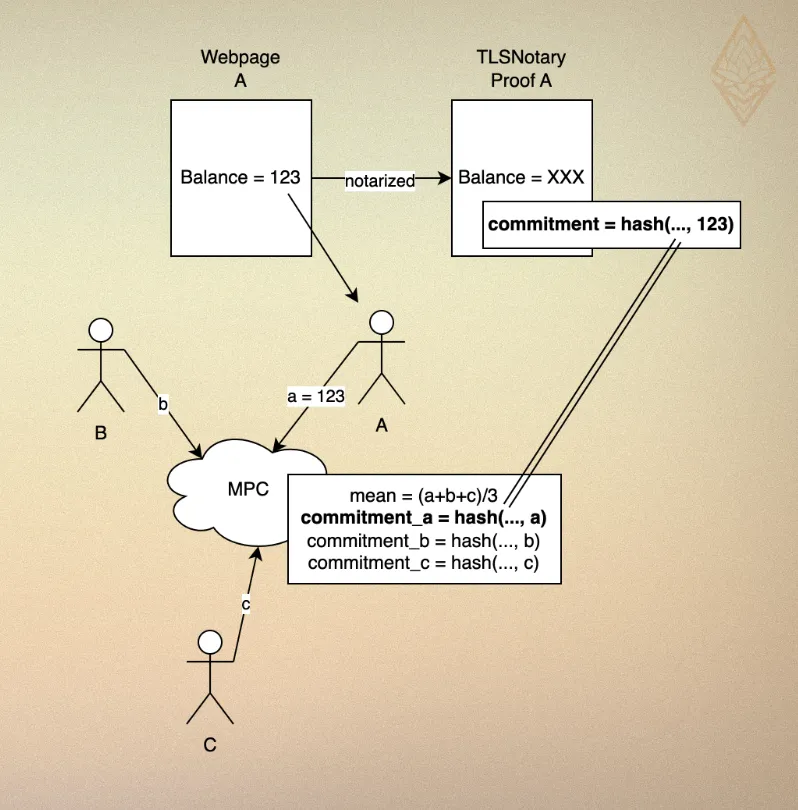
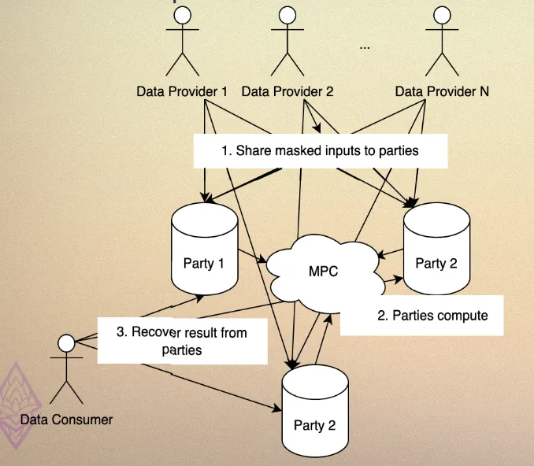

# Technical Details

## Input Authentication

- Data providers prove their Binance balance using TLSNotary.
- During MPC, the balance is used as a private input, and a TLSNotary commitment is calculated and revealed alongside the stats result.
- All parties verify the TLSNotary proof to ensure that the private input matches the commitment, providing input correctness.

## Client Interface

In vanilla MPC, for data consumers to know the results from a computation, all data providers and consumers must stay online all the time, but that's not practical for

- Data Providers: Share masked balances with 3 computation parties via secret sharing. This allows them to go offline after providing their data.
- Computation Parties: Perform MPC to compute the statistical result.
- Data Consumers: Query results from the computation parties, ensuring asynchronous participation.

## Benchmarks

MPC Protocol: Settled on [`mal-rep-ring`](https://mp-spdz.readthedocs.io/en/latest/readme.html#honest-majority), a malicious secure, honest majority protocol, i.e. it tolerates up to 1/3 malicious parties. We benchmarked through all MPC protocols provided by MP-SPDZ and found it's the most practical option for our demo:

- TLSNotary Data Commitment: Identified as a bottleneck operation but performed efficiently, taking roughly 1 second for 1-byte data.
- Mean Calculation: Computes the mean of 10,000 numbers in under 0.2 seconds.

See [here](https://pse-team.notion.site/Choosing-a-Suitable-MPC-Protocol-fffd57e8dd7e8034b4d7c75b02d79ed3) for more details.

## Comparison with Existing Works

We evaluate the technology using this [framework](https://arxiv.org/pdf/2012.08347)

- Input Privacy: Can process information hidden from you
  - Make sure service providers process data without being able to see it or use it for other purposes outside of the governed info flow.
  - Most tech we know: zkp, mpc, fhe, enclave, …
- Output Privacy: Cannot reverse engineer input from output
  - Differential Privacy (DP) gives limit on the likelihood that can infer input,eEspecially for preventing linkability of data that is split by category. For example, if documents are grouped by authors employer, then statistics are calculated across documents, DP can prevent one from knowing info specific to an employer.
- Input Verification: Ensure that the information comes form you
  - public key infra, digital signature, zkp (ability to verify the input to arbitrary computation)
- Output Verification: Ensure the process of calculation is correct
  - Without causing recursive oversight problem
- Flow Governance: Who holds authority to modify the flow
  - mostly MPC to not concentrate power withint one entity

#### 1.[PySyft](https://github.com/OpenMined/PySyft): PET with [data science](https://ep2024.europython.eu/session/pysyft-data-science-on-data-you-are-not-allowed-to-see/)

**Product**

- **Target Users**: Remote Research! PySyft from Open Mined is non-profit foundation to build the public network for non-public information, mostly geared towards data scientists & researchers that want to operate a certain algorithm over private data.
  - It connects objective-aligned researchers with data owners for research itself!
  - Data Owner wants to collaborate and share their data for researchers in a private way.
- **How to Use**:
  - import syft as sy, then users can write everything as plain Python, and just integrate with sy after each step.
- Serve Two sides, both data provider and data consumer.
  - Data provider can create corresponding mock data, create account for eligible researchers, then approve the algorithm.
    - Datasites are servers for non-public data that maintain strict control over data access and use. Datasites can be deployed on local computers, in a cluster, or in the cloud. And for more stringent security, Datasites support air-gapped configuration to separate the prototyping environment from code execution.
  - Data consumer can test their algorithm with mock data and request the computation result. All this can be done in Python!
- **What calculations**: support only Python CPU, GPU.

**Technology**

- **Input Privacy**: Running locally or encrypted and transfer to use with enclaves (TEE, confidential container by Microsoft Azure and such as well)
- **Output Privacy**: -
- **Input Verification**: By partnering up with Syft. If using [TEE](https://blog.openmined.org/secure-enclaves-for-ai-evaluation/), verify the match between in TEEE and the reference values in the stakeholder datasite itself.
- **Output Verification**: Secure enclaves with code attestation from a trusted third-party service (e.g. Microsoft Azure's Remote Attestation Service, NVIDIA Remote Attestation Service). [WIP]
- **Flow Governance**: For multi-party: stakeholders within both firms. For single party, now p scary since we upload original dataset to datasite…..why?
- **Number of Parties**: Mostly one, but if multiple, [still in experiment] will use secure enclave. Syft will orchestrate various approvals necessary from the organizations to allow your computation.

##### 2.[Rosetta](https://github.com/LatticeX-Foundation/Rosetta)

**Product**

- **Target Users**: By [Lattice Foundation](https://latticex.foundation/) to develop a large-scale distributed interoperable computational network that supports the expansive economy activities and broader business applications.
  - Accelerator, Research Pioneer, Facilitator
- **How to Use**:
  `import latticex.rosetta as rtt` - Then write tensorflow with it! —> interface is not really that easy, more like mp-spdz
- **What calculations**: Anything written in Tensorflow

**Technology**

- **Input Privacy**: MPC for 3 parties using SecureNN and Helix (both semi-honest model with honest majority)
- **Output Privacy**: -
- **Input Verification:** -
- **Output Verification**: Mystique, zkp for secure inference of AI
- **Flow Governance**: by design
- **Number of Parties**: 3

##### 3. [Secretflow](https://github.com/secretflow/secretflow) (Unified framework for privacy-preserving ml & data analysis)

**Product**

- **Target Users**: One-stop-shop for developers in privacy preserving tech: from poc to production-ready. Claim to be modular enough to support most PETs, and ML framework including PyTorch & JAX
  - Specifically SPU is Domain-specific compiler and runtime suite for ML
- **How to Use**: import spu.utils.distributed as ppd,
  - and then can just write JAX
  - Very nice abstraction of multiparty-computation.
- **What calculations**: All that ML framework supported

**Technology (SPU itself)**

Their strength seems to still lie in its [paper](https://www.usenix.org/system/files/atc23-ma.pdf) as a compiler and runtime suite that converts ML programs into an MPC-specific IR and executes IR in an MPC manner. Still haven't seen much about the full integration stack.

- **Input Privacy**: MPC
- **Output Privacy**: -
- **Input Verification**: -
- **Output Verification**: -
- **Flow Governance**: by design
- **Number of Parties**: multiple

##### 4. [Nillion](https://docs.nillion.com/)

**Product**

- **Target Users**: Developer building application at intersection of Blockchain <> Data (mostly AI)
- **How to Use**:
  - Need to write program using Nada Language, and deploy it similar to other blockchains.
- **What calculations**: Anything written in their own language (Nada)

**Technology**

- **Input Privacy**: MPC: use 2 phases: interactive pre-processing phase (not depend on input) and non-interactive computing phase
- **Output Privacy**: Just by MPC, not seeing DP yet
- **Input Verification**: Similar to blockchain, so yes tied to your Nillion wallet address
- **Output Verification**: Yes, its on network itself
- **Flow Governance**: by design
- **Number of Parties**: multiple
- **Paper**: https://nillion.pub/sum-of-products-lsss-non-interactive.pdf
- Note: This is not the same as client interface! Because this still requires all computation parties to be online at the same time in pre-processing phase. And in this example, there is no concept of client, since the party is involved in MPC operation itself. However, we can literally integrate client interface with this protocol.
- Note2: Information-theoretic security is a bit different than typical encryption, because it has no adversarial computational assumption. However, this is all still be pointless if some threshold of parties are corrupted (based on mpc security) similar to all MPCs anyway.
